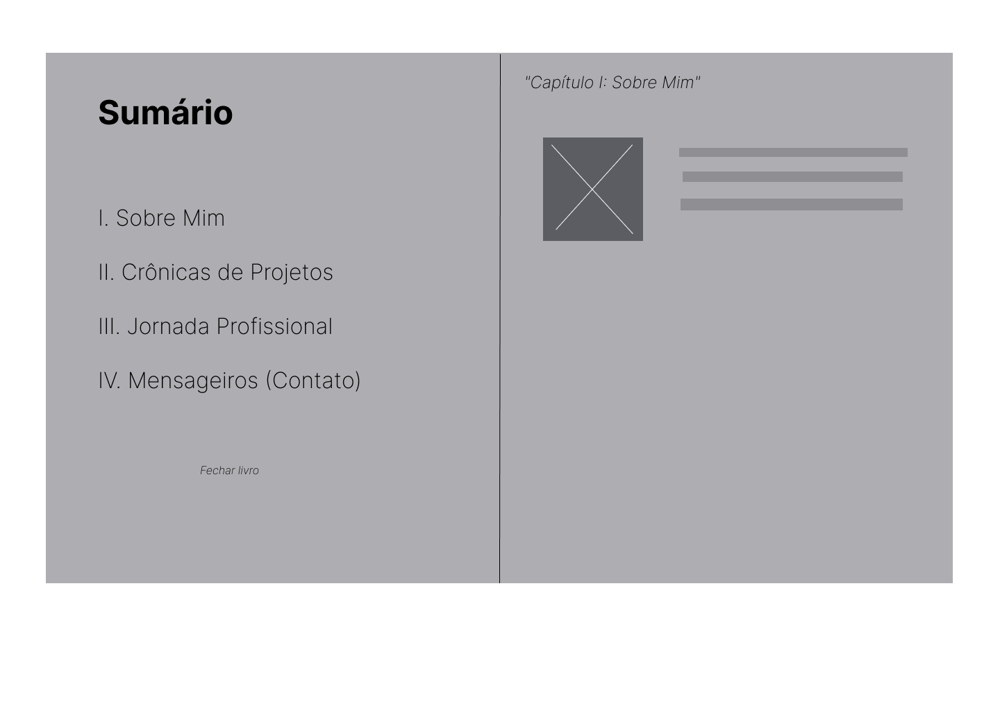

# Portfólio Profissional - As Crônicas de Gustavo 🗡️📜

**Disciplina:** Laboratório de Desenvolvimento de Software
**Sprint:** 01 (Lab01S01)

## 📖 Descrição do Projeto
Este projeto é um website de portfólio profissional interativo, construído com a temática e o design de um **livro épico medieval**. O objetivo é apresentar minha trajetória, habilidades, projetos (artefatos) e formas de contato de maneira criativa, moderna e imersiva, substituindo a rolagem tradicional por uma navegação estilo "sumário e páginas".

## 🛠️ Tecnologias e Ferramentas Previstas
* **Front-end:** React.js com TypeScript (via Vite)
* **Estilização:** Tailwind CSS (para tipografia medieval e cores de pergaminho)
* **Animações (Futuro):** Framer Motion (para o efeito de virar as páginas)
* **Design/Prototipação:** Figma
* **Hospedagem (Futuro):** Vercel ou Render

## 🖼️ Protótipos (Wireframes)
Abaixo estão os wireframes de média fidelidade demonstrando a capa de entrada e a estrutura de "livro aberto" com navegação lateral.

### Capa do Tomo

### Estrutura Interna (Livro Aberto)

## ⚙️ Estrutura Inicial do Site
O front-end já foi inicializado com a seguinte estrutura principal de navegação:
* **Capa:** Landing page inicial convidando o usuário a "Abrir o Tomo".
* **Navegação (Página Esquerda):** Sumário fixo contendo os links para os capítulos.
* **Conteúdo (Página Direita):** Área dinâmica que renderiza os componentes de `Sobre Mim`, `Projetos`, `Experiências` e `Contato` sem recarregar a página.

## 🚀 Como rodar o projeto localmente
1. Clone este repositório:
   `git clone https://github.com/GustavoFirmino/Portifolio.git`
2. Acesse a pasta do projeto e instale as dependências:
   `npm install`
3. Inicie o servidor de desenvolvimento:
   `npm run dev`